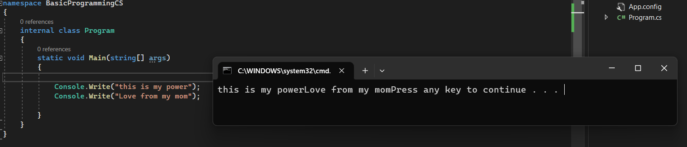
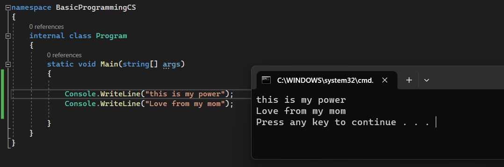

# CsharpforUNITYbegining

<h1> พื้นฐานภาษา C# ก่อนนำไปใช้ร่วมกับ UNITY ในการสร้างเกม  </h1>
<h2>Learning C# from  <a href="https://www.w3schools.com/cs/index.php">W3school</a></h2>

<h2>ภาษาC#สามารถนำไปใช้ได้หลายอย่างมากอย่างเข่น</h2> 
<ul>
<li>Mobile applications</li>
<li>Desktop applications</li>
<li>Web applications</li>
<li>Web services</li>
<li>Web sites</li>
<li>Games</li>
<li>VR</li>
<li>Database applications</li>
  <li>และอื่นๆอื่กมากมายหลายอย่าง</li>
</ul>

# syntax

<h1>การแสดงผลทางจอภาพ</h1>

<h3>Write , Writeline</h3>

<h2>Write แสดงผลแบบไม่มีการขึ้นบรรทัดใหม่</h2>
<h2>Writeline แสดงผลโดยจะมีการขึ้นบรรทัดใหม่</h2>
<h3>Write(ข้อความ/ตัวเลข/ตัวแปร/เมธอด/ตัวดำเนินการ)</h3>

<h3>Writeline(ข้อความ/ตัวเลข/ตัวแปร/เมธอด/ตัวดำเนินการ)</h3>

